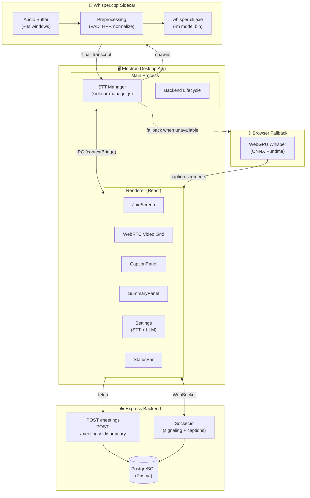
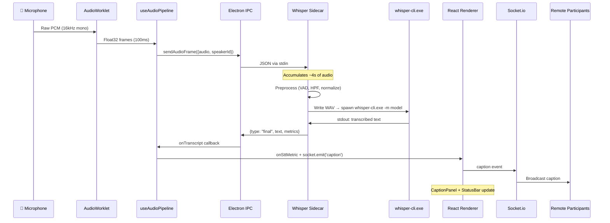
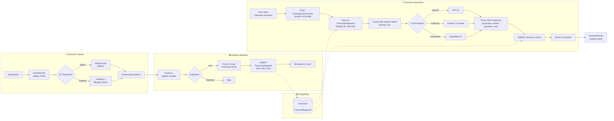

# 🎙️ MeetSummarizer

**Real-time meeting captions & AI summaries — running entirely on your machine.**

An Electron desktop app that transcribes live conversations using on-device Whisper.cpp, streams video via WebRTC, and generates AI meeting summaries — all while keeping your audio local.

---

## Why MeetSummarizer?

Meetings generate insight, but most of it vanishes the moment the call ends. MeetSummarizer captures every word with **real-time captions**, then distills conversations into **actionable AI summaries**. Unlike cloud-only tools, speech-to-text runs **entirely on your device** — no audio ever leaves your machine.

---

## ✨ Features

| Category | Capabilities |
|----------|-------------|
| 🎤 **Live Captions** | Real-time transcription in-meeting, displayed in a scrollable transcript panel |
| 🤖 **AI Summaries** | One-click meeting summaries via OpenAI or bring-your-own LLM key |
| 🎥 **Video & Audio** | Peer-to-peer WebRTC with mute, video toggle, and multi-participant grid |
| 🔒 **Privacy-First** | STT runs locally via Whisper.cpp — audio never sent to a cloud service |
| ⚡ **GPU Accelerated** | Vulkan GPU backend for fast transcription; falls back to browser WebGPU |
| 🔌 **Offline-Ready STT** | Native sidecar process keeps working even with spotty internet |
| 📊 **Status Bar** | Live model, backend, inference state, and realtime factor display |

---

## 🧰 Tech Stack

| Layer | Technology | Why |
|-------|-----------|-----|
| **Desktop Shell** | Electron 42 | Cross-platform native window, preload bridge, IPC |
| **UI Renderer** | React 19 + Vite + Tailwind CSS | Component-based UI, dark theme, responsive layout |
| **Video / Audio** | WebRTC (simple-peer) | Peer-to-peer streaming, no server relay for media |
| **Signaling** | Socket.io | Real-time WebRTC handshake, presence, caption relay |
| **On-Device STT** | Whisper.cpp (C++ sidecar) | Fast, local transcription with Vulkan GPU acceleration |
| **Browser Fallback** | WebGPU Whisper (ONNX) | On-device transcription when native sidecar is unavailable |
| **Backend API** | Express 5 + Prisma | REST endpoints for meetings and summaries |
| **Database** | PostgreSQL | Meeting records, transcripts, summaries |
| **LLM Summary** | OpenAI API (or bring-your-own key) | Distills transcripts into structured summaries |

---

## 🏗️ Architecture

### System Overview



### Caption Data Flow (Sequence)



### Caption → Summary Pipeline

Every caption segment is persisted to PostgreSQL as it arrives, creating a growing transcript that can be summarized at any time — no re-transcription needed.



**Key design point:** Transcripts are append-only and immutable — summaries read directly from stored segments. This means you can regenerate summaries at any point (e.g., mid-meeting, after switching LLM providers) without re-transcribing audio.

---

## 🚀 Getting Started

### Prerequisites
- **Node.js 18+**
- **Docker Desktop** (for local backend + PostgreSQL)
- A deployed backend URL (for production builds)

### Quick start (local dev)

```bash
# 1. Install dependencies
npm install
npm --prefix frontend install
npm --prefix desktop install
npm --prefix backend install

# 2. Start PostgreSQL
docker compose up -d db

# 3. Run database migrations
npm --prefix backend run prisma:migrate

# 4. Launch the app (builds frontend + starts local backend + opens Electron)
npm run dev:local
```

### Connect to a deployed backend

```bash
# PowerShell
$env:MEETSUMMARIZER_API_URL="https://api.yourdomain.com"
npm run dev
```

> **Note:** If `MEETSUMMARIZER_API_URL` is not set and you're not in local mode, the app will exit with a clear error rather than silently failing.

---

## 🧠 STT & Model Management

Speech-to-text runs **locally** using a Whisper.cpp sidecar process. No audio is sent to any cloud service.

### Available Models

| Model | Size | Best For |
|-------|------|----------|
| `tiny.en` | 78 MB | Fast, low-resource machines |
| `base.en` | 148 MB | Good accuracy/speed balance |
| `small.en` | 488 MB | Better accuracy for meetings |
| `medium.en` | 1.5 GB | Best accuracy, powerful machines |

### Backends

| Backend | Hardware | Notes |
|---------|----------|-------|
| **CPU** | Any machine | Included by default |
| **Vulkan** | NVIDIA/AMD GPU | 2-5× faster inference |

Models are downloaded and switched from **Settings → Speech-to-text**. The status bar shows live inference state and download progress.

---

## 📁 Project Structure

```
MeetSummarizer/
├── desktop/                     # Electron shell
│   ├── main.js                  # Main process: window, IPC, backend lifecycle
│   ├── preload.js               # contextBridge: desktopConfig + desktopStt APIs
│   └── stt/
│       ├── sidecar-manager.js   # NativeSttManager: spawn, lifecycle, state
│       ├── whisper-streaming-sidecar.js  # Whisper.cpp orchestrator
│       └── bin/                 # Prebuilt whisper-cli binaries (CPU, Vulkan)
├── frontend/                    # React renderer (Vite)
│   └── src/
│       ├── App.jsx              # Root: routing, socket, meeting state
│       ├── components/
│       │   ├── JoinScreen.jsx   # Create/join meeting + STT settings
│       │   ├── MeetingControls.jsx
│       │   ├── CaptionPanel.jsx # Real-time transcript display
│       │   ├── SummaryPanel.jsx # AI summary generation + display
│       │   ├── SettingsModal.jsx# Device, STT, LLM configuration
│       │   ├── SttStatusBar.jsx # Live model/backend/inference status
│       │   └── VideoView.jsx    # WebRTC video rendering
│       ├── hooks/
│       │   ├── useWebRTC.js     # Peer connections + signaling
│       │   └── useAudioPipeline.js  # Audio capture → STT dispatch
│       └── workers/
│           ├── audio-processor.js          # AudioWorkletProcessor
│           └── transcription.worker.js     # WebGPU Whisper fallback
├── backend/                     # Express + Socket.io API
│   ├── index.js                 # REST endpoints + signaling server
│   └── prisma/
│       └── schema.prisma        # Data models
├── scripts/                     # Dev orchestration scripts
├── docker-compose.yml           # Local Postgres + backend
└── package.json                 # Root orchestrator
```

---

## 🔑 Key Engineering Decisions

### Why a native Whisper.cpp sidecar instead of browser-only?
Browser WebGPU Whisper works, but model loading is slow (~5-15s) and GPU support varies. A native C++ sidecar process loads models instantly, supports Vulkan acceleration, and doesn't tie up the renderer thread. The app falls back to WebGPU transparently if the sidecar is unavailable.

### Why Electron instead of a web app?
- **Local STT requires native binaries** — a web-only app can't spawn processes or access GPU backends.
- **Privacy**: keeping STT local means audio never touches a server.
- **Desktop integration**: window management, IPC bridge for native↔web communication.

### Why WebRTC peer-to-peer instead of server-relayed media?
Peer-to-peer video keeps latency low and avoids server bandwidth costs. The backend only handles lightweight signaling (offers, answers, ICE candidates) via Socket.io — no media passes through the server.

### Race condition fixed in model switching
When switching Whisper models, the old sidecar process is killed and a new one spawned. The old process's `exit` event fired **after** the new process started and would corrupt the new process's state — a classic cleanup race condition. Fixed by removing all event listeners (`removeAllListeners()`) before killing the old process, ensuring stale handlers can never fire.

---

## 📊 Status Bar

During a meeting, the sidebar footer shows live STT state:

| Indicator | State | Meaning |
|-----------|-------|---------|
| 🟢 Green dot | **Idle** | Sidecar running, waiting for speech |
| 🟠 Amber pulsing | **Inferring** | Transcribing an audio window (shows live RTF) |
| 🔵 Progress bar | **Downloading** | Model download in progress (% + bytes) |
| 🔴 Red dot | **Unavailable** | No backend or no model available |
| ⚪ Gray dot | **Stopped** | Sidecar process stopped |

The model pill shows `<filename>` + `<CPU | VULKAN>`. RTF (realtime factor) indicates transcription speed — `RTF 0.40x` means 2.5× faster than real-time.

---

## 📦 Build & Deploy

### Desktop app

```bash
npm run build:desktop
```

Installers output to `desktop/release/`. Set the production backend URL:

```env
MEETSUMMARIZER_API_URL=https://api.yourdomain.com
```

### Backend

```bash
# Deploy migrations
npx prisma migrate deploy

# Start server (defaults to port 4000)
npm start
```

Required env vars: `DATABASE_URL`, `PORT`, `CORS_ORIGIN`.

---

## 🔧 Troubleshooting

| Problem | Solution |
|---------|----------|
| **"Desktop launch required"** | Must launch from Electron — opening `index.html` in a browser won't work |
| **No captions appearing** | Check status bar for sidecar state; ensure a model is downloaded in Settings → STT |
| **SSL / fetch errors** | Use `npm run dev:local` or set `MEETSUMMARIZER_API_URL` to an HTTP URL |
| **Sidecar won't start** | Verify `desktop/stt/bin/` contains platform binaries and a model file exists |
| **Slow first inference** | After switching models, the first inference loads the model from disk (1-10s) |

---

Built with ❤️ — audio stays local, insights go everywhere.
