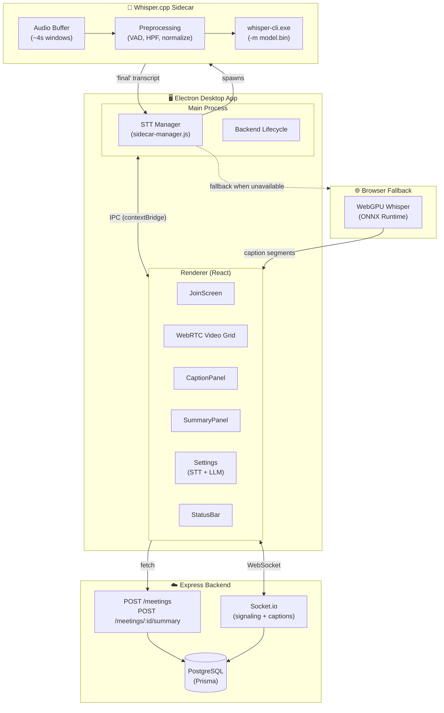
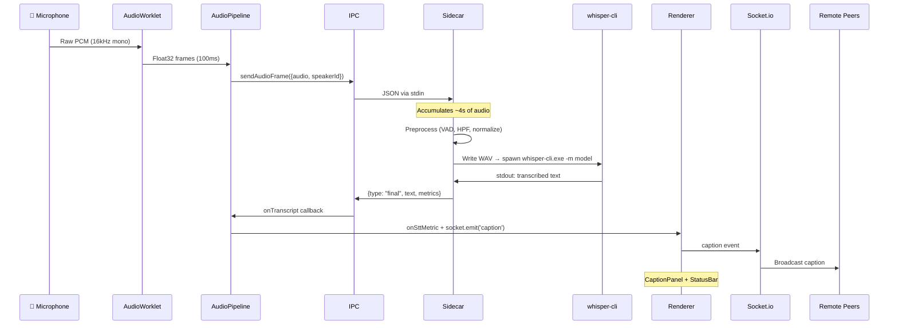
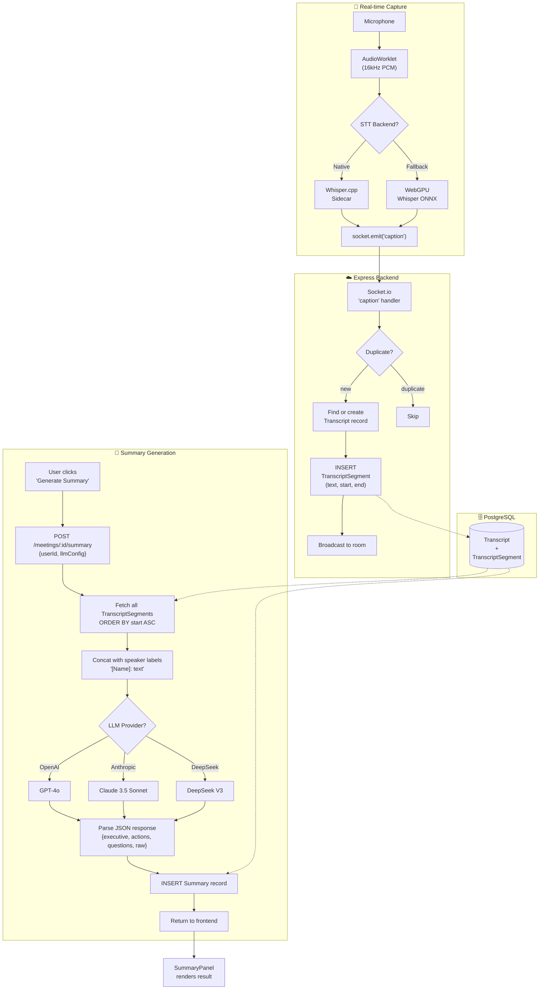
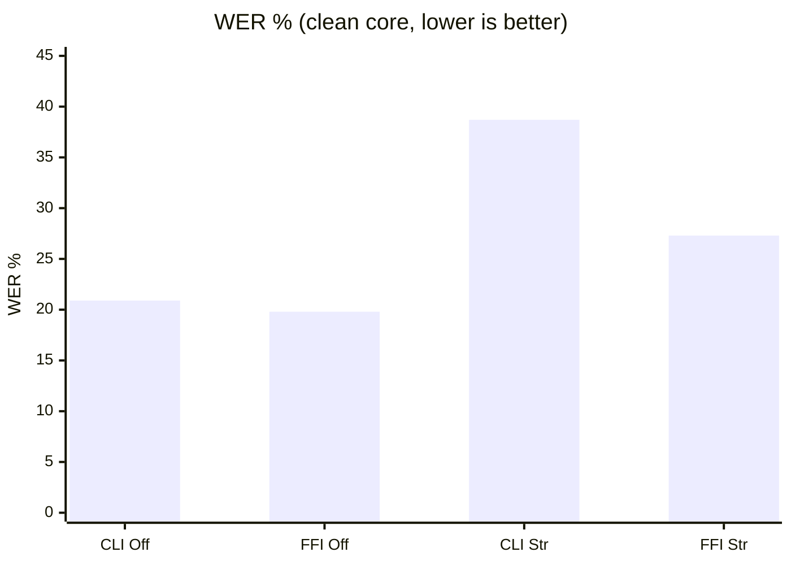

# 🎙️ MeetSummarizer

**Real-time meeting captions & AI summaries — running entirely on your machine.**

An Electron desktop app that transcribes live conversations using on-device Whisper.cpp, streams video via WebRTC, and generates AI meeting summaries — all while keeping your audio local.

---

## Why MeetSummarizer?

Meetings generate insight, but most of it vanishes the moment the call ends. MeetSummarizer captures every word with **real-time captions**, then distills conversations into **actionable AI summaries**. Unlike cloud-only tools, speech-to-text runs **entirely on your device** — no audio ever leaves your machine.

---

## ✨ Features

| Category | Capabilities |
|----------|-------------|
| 🎤 **Live Captions** | Real-time transcription in-meeting, displayed in a scrollable transcript panel |
| 🤖 **AI Summaries** | One-click meeting summaries via OpenAI or bring-your-own LLM key |
| 🎥 **Video & Audio** | Peer-to-peer WebRTC with mute, video toggle, and multi-participant grid |
| 🔒 **Privacy-First** | STT runs locally via Whisper.cpp — audio never sent to a cloud service |
| ⚡ **GPU Accelerated** | Optional NVIDIA CUDA 11.8 and cross-vendor Vulkan backends; falls back to browser WebGPU |
| 🔌 **Offline-Ready STT** | Native sidecar process keeps working even with spotty internet |
| 📊 **Status Bar** | Live model, backend, inference state, and realtime factor display |

---

## 🧰 Tech Stack

| Layer | Technology | Why |
|-------|-----------|-----|
| **Desktop Shell** | Electron 42 | Cross-platform native window, preload bridge, IPC |
| **UI Renderer** | React 19 + Vite + Tailwind CSS | Component-based UI, dark theme, responsive layout |
| **Video / Audio** | WebRTC (simple-peer) | Peer-to-peer streaming, no server relay for media |
| **Signaling** | Socket.io | Real-time WebRTC handshake, presence, caption relay |
| **On-Device STT** | Whisper.cpp (C++ sidecar) | Fast, local transcription with CUDA, Vulkan, or CPU inference |
| **Browser Fallback** | WebGPU Whisper (ONNX) | On-device transcription when native sidecar is unavailable |
| **Backend API** | Express 5 + Prisma | REST endpoints for meetings and summaries |
| **Database** | PostgreSQL | Meeting records, transcripts, summaries |
| **LLM Summary** | OpenAI API (or bring-your-own key) | Distills transcripts into structured summaries |

---

## 🏗️ Architecture

### System Overview


```mermaid
graph TB
    subgraph Electron["🖥️ Electron Desktop App"]
        subgraph Main["Main Process"]
            STTMgr["STT Manager<br/>(sidecar-manager.js)"]
            BackendLifecycle["Backend Lifecycle"]
        end

        subgraph Renderer["Renderer (React)"]
            JoinScreen["JoinScreen"]
            VideoGrid["WebRTC Video Grid"]
            CaptionPanel["CaptionPanel"]
            SummaryPanel["SummaryPanel"]
            Settings["Settings<br/>(STT + LLM)"]
            StatusBar["StatusBar"]
        end

        Main <-->|"IPC (contextBridge)"| Renderer
    end

    subgraph Sidecar["🧠 Whisper.cpp Sidecar"]
        AudioBuf["Audio Buffer<br/>(~4s windows)"]
        Preprocess["Preprocessing<br/>(VAD, HPF, normalize)"]
        Whisper["whisper-cli.exe<br/>(-m model.bin)"]
        AudioBuf --> Preprocess --> Whisper
    end

    subgraph Backend["☁️ Express Backend"]
        REST["POST /meetings<br/>POST /meetings/:id/summary"]
        SocketIO["Socket.io<br/>(signaling + captions)"]
        DB[("PostgreSQL<br/>(Prisma)")]
        REST --> DB
        SocketIO --> DB
    end

    subgraph Browser["🌐 Browser Fallback"]
        WebGPU["WebGPU Whisper<br/>(ONNX Runtime)"]
    end

    STTMgr -->|"spawns"| Sidecar
    STTMgr -.->|"fallback when unavailable"| Browser
    Renderer -->|"fetch"| REST
    Renderer <-->|"WebSocket"| SocketIO
    Sidecar -->|"'final' transcript"| STTMgr
    WebGPU -->|"caption segments"| Renderer
```

### Caption Data Flow (Sequence)


```mermaid
sequenceDiagram
    participant Mic as 🎤 Microphone
    participant AW as AudioWorklet
    participant Hook as AudioPipeline
    participant IPC as IPC
    participant SC as Sidecar
    participant WCPP as whisper-cli
    participant Renderer as Renderer
    participant Socket as Socket.io
    participant Remote as Remote Peers

    Mic->>AW: Raw PCM (16kHz mono)
    AW->>Hook: Float32 frames (100ms)
    Hook->>IPC: sendAudioFrame({audio, speakerId})
    IPC->>SC: JSON via stdin

    Note over SC: Accumulates ~4s of audio

    SC->>SC: Preprocess (VAD, HPF, normalize)
    SC->>WCPP: Write WAV → spawn whisper-cli.exe -m model
    WCPP->>SC: stdout: transcribed text
    SC->>IPC: {type: "final", text, metrics}

    IPC->>Hook: onTranscript callback
    Hook->>Renderer: onSttMetric + socket.emit('caption')
    Renderer->>Socket: caption event
    Socket->>Remote: Broadcast caption

    Note over Renderer: CaptionPanel + StatusBar
```

### Caption → Summary Pipeline

Every caption segment is persisted to PostgreSQL as it arrives, creating a growing transcript that can be summarized at any time — no re-transcription needed.


```mermaid
graph TB
    subgraph Capture["🎤 Real-time Capture"]
        Mic["Microphone"] --> AW["AudioWorklet<br/>(16kHz PCM)"]
        AW --> Route{"STT Backend?"}
        Route -->|"Native"| Sidecar["Whisper.cpp<br/>Sidecar"]
        Route -->|"Fallback"| WebGPU["WebGPU<br/>Whisper ONNX"]
        Sidecar --> CaptionEvent["socket.emit('caption')"]
        WebGPU --> CaptionEvent
    end

    subgraph Backend["☁️ Express Backend"]
        CaptionEvent --> SocketHandler["Socket.io<br/>'caption' handler"]
        SocketHandler --> Idempotency{"Duplicate?"}
        Idempotency -->|"new"| FindTranscript["Find or create<br/>Transcript record"]
        FindTranscript --> SaveSegment["INSERT<br/>TranscriptSegment<br/>(text, start, end)"]
        SaveSegment --> Broadcast["Broadcast to room"]
        Idempotency -->|"duplicate"| Skip["Skip"]
    end

    subgraph Storage["🗄️ PostgreSQL"]
        SaveSegment -.-> DB[("Transcript<br/>+<br/>TranscriptSegment")]
    end

    subgraph Summary["🤖 Summary Generation"]
        UserClick["User clicks<br/>'Generate Summary'"]
        UserClick --> PostReq["POST /meetings/:id/summary<br/>{userId, llmConfig}"]
        PostReq --> FetchSegments["Fetch all TranscriptSegments<br/>ORDER BY start ASC"]
        DB -.-> FetchSegments
        FetchSegments --> Concat["Concat with speaker labels<br/>'[Name]: text'"]
        Concat --> LLM{"LLM Provider?"}
        LLM -->|"OpenAI"| GPT["GPT-4o"]
        LLM -->|"Anthropic"| Claude["Claude 3.5 Sonnet"]
        LLM -->|"DeepSeek"| DS["DeepSeek V3"]
        GPT --> Parse["Parse JSON response<br/>{executive, actions, questions, raw}"]
        Claude --> Parse
        DS --> Parse
        Parse --> SaveSummary["INSERT Summary record"]
        SaveSummary --> ReturnSummary["Return to frontend"]
        DB -.-> SaveSummary
    end

    ReturnSummary --> Display["SummaryPanel<br/>renders result"]
```

**Key design point:** Transcripts are append-only and immutable — summaries read directly from stored segments. This means you can regenerate summaries at any point (e.g., mid-meeting, after switching LLM providers) without re-transcribing audio.

---

## Documentation

- [Testing and manual verification](docs/TESTING.md)
- [WebGPU STT baseline benchmark](docs/STT_WEBGPU_BENCHMARK.md)
- [Native STT WER benchmark](docs/STT_NATIVE_WER_BENCHMARK.md)

## 🚀 Getting Started

### Prerequisites
- **Node.js 22.12 or newer**
- **Docker Desktop** (for local backend + PostgreSQL)
- A deployed backend URL (for production builds)

### Quick start (local dev)

```bash
# 1. Install dependencies
npm install
npm --prefix frontend install
npm --prefix desktop install
npm --prefix backend install

# 2. Create the local backend environment file
cp backend/.env.example backend/.env

# 3. Start PostgreSQL
docker compose up -d db

# 4. Run database migrations
npm --prefix backend run prisma:migrate

# 5. Launch the app (builds frontend + starts local backend + opens Electron)
npm run dev:local
```

### Connect to a deployed backend

```bash
# PowerShell
$env:MEETSUMMARIZER_API_URL="https://api.yourdomain.com"
npm run dev
```

> If `MEETSUMMARIZER_API_URL` is not set outside local mode, Electron uses the production API URL currently configured in `desktop/main.js`.

### Summary providers and models

Open **Settings → AI Summary Settings** to keep a separate API key and model selection for each provider. Only the active provider's key is sent to the configured backend when a summary is generated; keys are not stored with summary records.

| Provider | Models | Default |
|----------|--------|---------|
| OpenAI | GPT-5.6 Sol, GPT-5.6 Terra, GPT-5.6 Luna | GPT-5.6 Terra |
| Anthropic | Claude Fable 5, Claude Opus 5, Claude Sonnet 5, Claude Haiku 4.5 | Claude Sonnet 5 |
| DeepSeek | DeepSeek V4 Pro, DeepSeek V4 Flash | DeepSeek V4 Flash |

The backend validates provider/model combinations and stores the exact model ID used for each generated summary. Deploy backend catalog changes to Railway before using a frontend build that exposes new models.

---

## 🧠 STT & Model Management

Speech-to-text runs **locally** using a Whisper.cpp sidecar process. No audio is sent to any cloud service.

### Available Models

| Model | Size | Best For |
|-------|------|----------|
| `tiny.en` | 78 MB | Fast, low-resource machines |
| `base.en` | 148 MB | Good accuracy/speed balance |
| `small.en` | 488 MB | Better accuracy for meetings |
| `medium.en` | 1.5 GB | Best accuracy, powerful machines |

### Backends

| Backend | Hardware | Notes |
|---------|----------|-------|
| **CUDA 11.8** | NVIDIA GPU, Windows x64 | Optional verified download: 266 MiB archive, about 594 MiB installed |
| **Vulkan** | NVIDIA/AMD/Intel GPU | Cross-vendor native GPU path when its local runtime is available |
| **CPU** | Any supported machine | Native fallback when its local runtime is available |

Models and the optional CUDA runtime are downloaded from **Settings → Speech-to-text**. Backend preference is persisted in Electron user data. `Auto` validates CUDA, then Vulkan, then CPU; an explicit backend choice is strict and uses browser WebGPU if that backend cannot start. CUDA downloads executable code from the pinned official `whisper.cpp v1.9.1` release, requires at least 1.2 GB of temporary free space, and can be cancelled or removed from Settings.

### Native STT Performance

Benchmarked on AMI Meeting Corpus (clean-core: 4/12 samples). Vulkan GPU via **new** koffi FFI bridge — no per-inference model reload.

| Mode | Model | WER | Caption lag | vs CLI |
|------|-------|-----|-------------|--------|
| Offline | base.en | **19.8%** | 287× realtime | **3.2× faster** |
| Streaming | base.en w4/o1 | 28.3% | **212ms** | **2.4× lower lag** |
| Streaming | small.en w6/o1 | **27.3%** | 337ms | **−11.4pp WER** |


```mermaid
xychart-beta
  title "WER % (clean core, lower is better)"
  x-axis ["CLI Off", "FFI Off", "CLI Str", "FFI Str"]
  y-axis "WER %" 0 --> 45
  bar [20.9, 19.8, 38.7, 27.3]
```

Full report → `benchmark-results/FFI-BENCHMARK-REPORT.md`

---

## 📁 Project Structure

```
MeetSummarizer/
├── desktop/                     # Electron shell
│   ├── main.js                  # Main process: window, IPC, backend lifecycle
│   ├── preload.js               # contextBridge: desktopConfig + desktopStt APIs
│   └── stt/
│       ├── sidecar-manager.js   # NativeSttManager: spawn, lifecycle, state
│       ├── whisper-streaming-sidecar.js  # Whisper.cpp orchestrator
│       ├── backend-installer.js # Verified optional backend download/extraction
│       └── bin/                 # Local packaged whisper-cli binaries (CPU, Vulkan)
├── frontend/                    # React renderer (Vite)
│   └── src/
│       ├── App.jsx              # Root: routing, socket, meeting state
│       ├── components/
│       │   ├── JoinScreen.jsx   # Create/join meeting + STT settings
│       │   ├── MeetingControls.jsx
│       │   ├── CaptionPanel.jsx # Real-time transcript display
│       │   ├── SummaryPanel.jsx # AI summary generation + display
│       │   ├── SettingsModal.jsx# Device, STT, LLM configuration
│       │   ├── SttStatusBar.jsx # Live model/backend/inference status
│       │   └── VideoView.jsx    # WebRTC video rendering
│       ├── hooks/
│       │   ├── useWebRTC.js     # Peer connections + signaling
│       │   └── useAudioPipeline.js  # Audio capture → STT dispatch
│       └── workers/
│           ├── audio-processor.js          # AudioWorkletProcessor
│           └── transcription.worker.js     # WebGPU Whisper fallback
├── backend/                     # Express + Socket.io API
│   ├── .env.example             # Local backend environment template
│   ├── index.js                 # REST endpoints + signaling server
│   └── prisma/
│       └── schema.prisma        # Data models
├── docs/
│   ├── TESTING.md               # Automated and manual verification
│   └── STT_WEBGPU_BENCHMARK.md  # Electron WebGPU fallback baseline
├── scripts/                     # Dev orchestration scripts
├── docker-compose.yml           # Local PostgreSQL; backend build currently limited
└── package.json                 # Root orchestrator
```

---

## 🔑 Key Engineering Decisions

### Why a native Whisper.cpp sidecar instead of browser-only?
Browser WebGPU Whisper works, but model loading is slow (~5-15s) and GPU support varies. A native C++ sidecar supports CUDA and Vulkan acceleration without tying up the renderer thread. Native candidates are preflighted with the selected model before the sidecar is reported ready; the app falls back to WebGPU if the requested native path is unavailable.

### Why Electron instead of a web app?
- **Local STT requires native binaries** — a web-only app can't spawn processes or access GPU backends.
- **Privacy**: keeping STT local means audio never touches a server.
- **Desktop integration**: window management, IPC bridge for native↔web communication.

### Why WebRTC peer-to-peer instead of server-relayed media?
Peer-to-peer video keeps latency low and avoids server bandwidth costs. The backend only handles lightweight signaling (offers, answers, ICE candidates) via Socket.io — no media passes through the server.

### Race condition fixed in model switching
When switching Whisper models, the old sidecar process is killed and a new one spawned. The old process's `exit` event fired **after** the new process started and would corrupt the new process's state — a classic cleanup race condition. Fixed by removing all event listeners (`removeAllListeners()`) before killing the old process, ensuring stale handlers can never fire.

---

## 📊 Status Bar

During a meeting, the sidebar footer shows live STT state:

| Indicator | State | Meaning |
|-----------|-------|---------|
| 🟢 Green dot | **Idle** | Sidecar running, waiting for speech |
| 🟠 Amber pulsing | **Inferring** | Transcribing an audio window (shows live RTF) |
| 🔵 Progress bar | **Downloading** | Model or optional backend installation in progress (% + bytes) |
| 🔴 Red dot | **Unavailable** | No backend or no model available |
| ⚪ Gray dot | **Stopped** | Sidecar process stopped |

The model pill shows `<filename>` + `<CUDA | VULKAN | CPU | WEBGPU>`. RTF (realtime factor) indicates transcription speed — `RTF 0.40x` means 2.5× faster than real-time.

---

## 📦 Build & Deploy

### Desktop app

```bash
npm run build:desktop
```

Installers output to `desktop/release/`. Set the production backend URL:

```env
MEETSUMMARIZER_API_URL=https://api.yourdomain.com
```

### Backend

```bash
# Deploy migrations
npx prisma migrate deploy

# Start server (defaults to port 4000)
npm start
```

Required env vars: `DATABASE_URL`, `PORT`, `CORS_ORIGIN`.

---

## 🔧 Troubleshooting

| Problem | Solution |
|---------|----------|
| **"Desktop launch required"** | Must launch from Electron — opening `index.html` in a browser won't work |
| **No captions appearing** | Check status bar for sidecar state; ensure a model is downloaded in Settings → STT |
| **SSL / fetch errors** | Use `npm run dev:local` or set `MEETSUMMARIZER_API_URL` to an HTTP URL |
| **Sidecar won't start** | Verify `desktop/stt/bin/` contains platform binaries and a model file exists |
| **Slow first inference** | After switching models, the first inference loads the model from disk (1-10s) |

---

Built with ❤️ — audio stays local, insights go everywhere.
