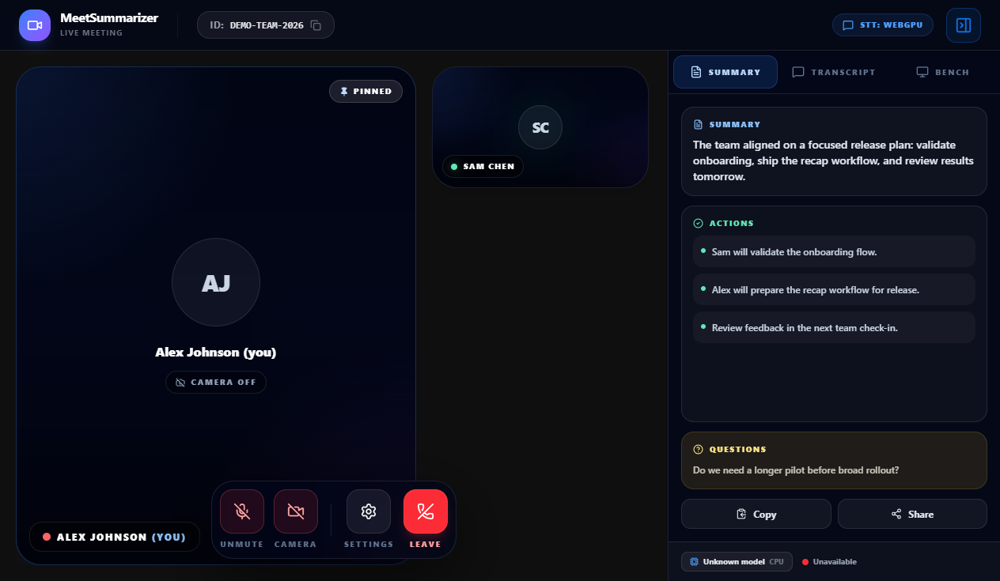
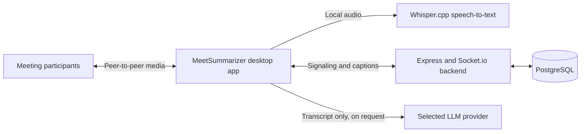

# MeetSummarizer

**Live meeting captions and AI summaries, with on-device speech-to-text.**

MeetSummarizer is a desktop meeting workspace for teams that want live captions, focused follow-up notes, and local audio transcription. Create or join a meeting, review captions as the conversation happens, and generate a structured summary when you are ready.

[Download v0.1.0](https://github.com/khuongngoduc0310/SummarizerApp/releases/download/v0.1.0/MeetSummarizer.Setup.0.1.0.exe)



## What It Does

- Captures live meeting captions with local Whisper.cpp speech-to-text.
- Keeps meetings connected over WebRTC, with Socket.io for signaling and caption relay.
- Generates concise summaries, action items, and open questions from the meeting transcript.
- Lets you select and download a local speech-to-text model from the app settings.

## First Meeting

1. Download and launch MeetSummarizer.
2. Open Settings and select or download a speech-to-text model.
3. Create a meeting or join one with its meeting ID. Add an API key in Settings only if you want AI-generated summaries.

## Privacy

Audio is transcribed on your device. When you request an AI summary, the stored transcript is sent to the LLM provider you selected in Settings. Audio is not sent to that provider.

## How It Works


```mermaid
graph LR
    Participants[Meeting participants] <-->|Peer-to-peer media| Desktop[MeetSummarizer desktop app]
    Desktop -->|Local audio| Whisper[Whisper.cpp speech-to-text]
    Desktop <-->|Signaling and captions| Backend[Express and Socket.io backend]
    Backend <--> Database[(PostgreSQL)]
    Desktop -->|Transcript only, on request| LLM[Selected LLM provider]
```

## Built With

- Electron and React for the desktop workspace.
- WebRTC and Socket.io for meeting connectivity, signaling, and caption relay.
- Whisper.cpp with local CUDA, Vulkan, CPU, or browser WebGPU fallback inference.
- Express, Prisma, and PostgreSQL for meetings, transcripts, and summaries.
- OpenAI, Anthropic, or DeepSeek for optional AI summaries.

Native speech-to-text supports GPU acceleration when an available local backend is selected. See the [native STT benchmark methodology](docs/STT_NATIVE_WER_BENCHMARK.md) for the reproducible evaluation procedure and its limitations.

## Build From Source

The source build uses the default deployed backend.

```bash
npm ci
npm --prefix backend ci
npm --prefix frontend ci
npm --prefix desktop ci
npm run build:desktop
```

## Documentation

- [Testing and manual verification](docs/TESTING.md)
- [Native STT benchmark methodology](docs/STT_NATIVE_WER_BENCHMARK.md)
- [WebGPU STT baseline benchmark](docs/STT_WEBGPU_BENCHMARK.md)

## Contributing

Bug reports and pull requests are welcome. Please start with [GitHub Issues](https://github.com/khuongngoduc0310/SummarizerApp/issues).

## License

MeetSummarizer is available under the [MIT License](LICENSE).
